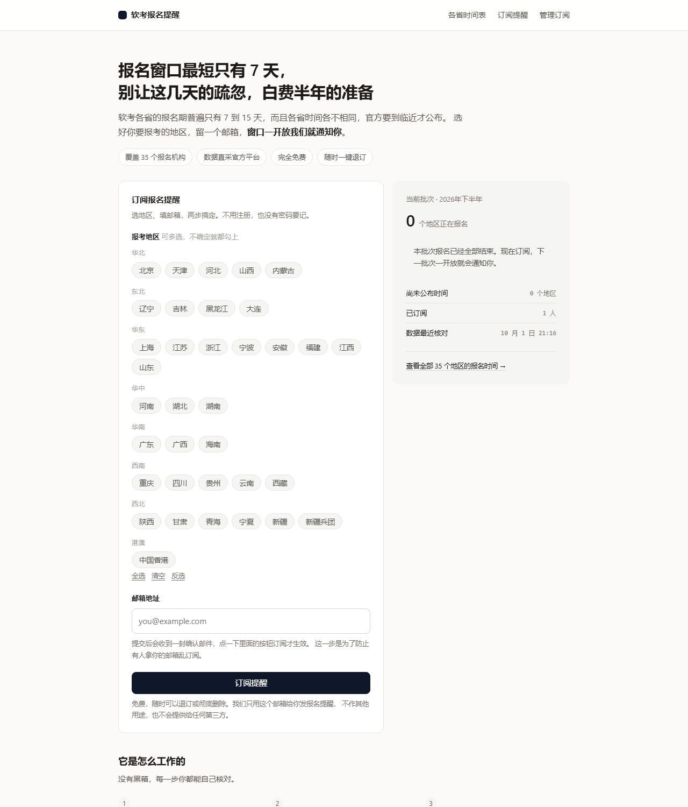
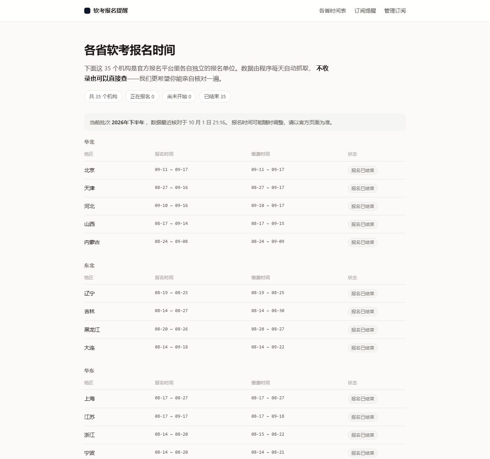

# 软考报名提醒

> 选好报考省市、留一个邮箱，软考报名窗口一开放就通知你。随时可以退订。

[](LICENSE)
[](https://www.python.org/)
[](requirements.txt)
[](tests/)



## 为什么需要它

软考各省的报名期普遍只有 7 到 15 天，各省时间互不相同，官方往往要到临近才公布。
每年都有人因为「没注意到」而白白错过，而错过一次就是半年。

问题的本质不是信息不存在，而是**信息存在但没有人替你盯着**。所以这个项目只做一件事：
选好地区，窗口一开就通知你。

**它只做提醒，不代办报名，不与官方有任何隶属关系。**

## 特性

- **数据直采官方平台**：每天两次自动抓取全国报名平台的机构时间表，覆盖 35 个报名单位
- **四个提醒节点**：时间公布 / 报名开放 / 报名截止前 48 小时 / 缴费截止前 24 小时
- **变化检测**：只有真的发生变化才发信，不会天天拿同一封邮件烦你
- **免密码**：没有注册、没有密码。订阅靠邮件确认，日后再想管理就重新收一封登录链接
- **零依赖存储**：SQLite 单文件，不需要额外部署数据库
- **开箱即用**：`git clone` 完装 5 个包就能跑，没有构建步骤

## 快速开始

```bash
git clone https://github.com/westsource/ruankao_notice.git
cd ruankao_notice

python -m venv .venv
source .venv/bin/activate          # Windows: .venv\Scripts\activate
pip install -r requirements.txt

cp .env.example .env
# 至少要改这两项：
#   SECRET_KEY   随机串，可用 python -c "import secrets;print(secrets.token_urlsafe(32))"
#   ADMIN_TOKEN  后台访问口令
# 想让邮件真的发出去，再配 MAIL_* 那几项

python cli.py doctor               # 体检：配置、连通性、数据库状态
python cli.py scrape               # 抓一次官方数据入库
python run.py                      # 启动，默认 http://localhost:3000
```

开发时把 `.env` 里的 `DRY_RUN` 设为 `true`，邮件不会真的发出去，只会写进日志——
这样你能把整条链路跑通而不惊动任何人。

## 配置

全部配置项见 `.env.example`，常用的这些：

| 变量 | 说明 |
| --- | --- |
| `SITE_URL` | 站点对外地址。邮件里的链接靠它拼，**部署后务必改对**，否则用户点开是 404 |
| `SECRET_KEY` | 签发会话与 CSRF 令牌。不设会临时随机生成，重启后所有人登录态失效 |
| `ADMIN_TOKEN` | `/admin` 的口令。**保持默认值等于把订阅数据公开** |
| `DB_PATH` | SQLite 文件位置，默认 `data/ruankao.db` |
| `MAIL_*` | SMTP 发信配置，见下 |
| `SCRAPE_TIMES` | 每日抓取时刻，默认 `08:10,20:10` |
| `SCHEDULER_ENABLED` | 是否在本进程跑定时任务。多实例部署时设为 `false` |
| `ALERT_EMAIL` | 抓取失败、页面对不上时的告警收件地址 |
| `DRY_RUN` | `true` 时不发真实邮件，只写日志 |

### 邮件

推荐腾讯企业邮（免费版需绑定域名）或专业推送服务。个人邮箱 SMTP 每日限额只有几十到几百封，
用户量上来必然不够。

多数邮箱要求用**授权码**而不是登录密码填 `MAIL_PASS`，否则会认证失败。

**送达率是这类服务能否活下去的关键**，请在发件域名侧配好这三条 DNS 记录：

```
TXT  @                     v=spf1 include:你的邮件服务商的spf记录 ~all
TXT  _dmarc                v=DMARC1; p=none; rua=mailto:you@example.com
```

DKIM 由邮件服务商生成密钥，按其指引添加 `TXT` 记录即可。三样齐了再开始对外发信，
否则大概率整批进垃圾箱——而用户根本不会去垃圾箱里找一封「报名提醒」。

本项目的邮件带 `List-Unsubscribe` 头，配合上面的 DNS 配置能明显改善投递表现。

### 关于短信

**本项目不提供短信通道，这是刻意的。**

国内短信签名报备要求企业或个体工商户主体，个人主体拿不到发送权限：

- 腾讯云：自 2025-09-18 起不再支持创建和修改个人自用资质，运营商不接受个人主体签名报备
- 阿里云：个人认证用户申请自用资质无法通过签名实名制报备

既然发不出去，代码里就不留一条永远走不通的路径——那只会让人以为「配一下就能用」。
如果你有主体资质并且确实需要短信，可以基于现有的 `notify.py` 加一个通道，
接口已经收敛得很干净。

## 部署

### Docker

```bash
cp .env.example .env    # 改好配置
docker compose up -d
```

`data/` 目录已挂载到宿主机，容器重建不会丢订阅数据。

### 手动

```bash
python run.py           # 用 waitress 起服务，单进程自带定时任务
```

生产环境建议前置 Nginx 处理 HTTPS 与静态资源，并把 `/admin` 限制到可信 IP。

### 部署前检查

- [ ] `SITE_URL` 改成真实域名——**拼错的后果是用户点开邮件全是坏链接**
- [ ] `ADMIN_TOKEN` 和 `SECRET_KEY` 都已改成随机值
- [ ] 域名完成 ICP 备案（服务器在境内时）
- [ ] SPF / DKIM / DMARC 已配置并验证
- [ ] 容器 / 服务器的时区为 `Asia/Shanghai`，否则定时任务会在错误的钟点跑
- [ ] `data/` 目录已纳入备份

## 后台

访问 `/admin`，用 `ADMIN_TOKEN` 登录。可以看到订阅统计、抓取记录、发送记录，
并手动触发抓取或提醒。

后台只有一个口令保护，够用但不强。建议在反向代理层再加一层 IP 白名单。

## 命令行

```bash
python cli.py doctor     # 体检：配置、官方页连通性、数据库状态
python cli.py scrape     # 只跑抓取
python cli.py notify     # 只跑提醒判定与发送
python cli.py run        # 抓取 + 提醒
python cli.py windows    # 打印当前批次的全部地区时间表
python cli.py demo       # 造一个已生效的订阅者，本地调试用
```

`doctor` 是排查问题的第一站：它会实际连一次官方页面并解析，页面对不上立刻就能看出来。

## 数据来源与解析规则

数据来自官方报名平台 <https://bm.ruankao.org.cn/sign/welcome>。
站内所有时间都汇总在「各省时间表」页，不订阅也能直接查：



该页面是**服务端渲染的静态 HTML**，无需登录、无需浏览器、无接口加密，一个 GET 就能拿到全量数据。
页面结构（2026-10 实测）：

```html
<select>
  <option selected="selected">2026年下半年软考</option>
</select>
...
<div class="layui-row listCont selectorg">
  <div class="layui-col-md3 col1">北京</div>                                     机构名
  <div class="layui-col-md4 col2 timeW">2026-09-11 00:00 ~ 2026-09-17 23:59</div>  报名
  <div class="layui-col-md4 col2 timeW">2026-09-11 00:00 ~ 2026-09-17 23:59</div>  缴费
  <div class="layui-col-md1 col2"><a class="aLink" task-id="..." or-id="...">进入</a></div>
</div>
```

两个设计要点：

1. **报名与缴费两个单元格的 class 完全相同**，只能靠行内顺序区分。所以解析器不按列下标取值，
   而是收集全部 `.timeW` 后按顺序解释；一旦官方把某列去掉，个数会从 2 变成 1，
   我们会记 warning 并向管理员告警，而不是错位写库——错位意味着用户收到完全错误的时间。
2. **机构名以 `regions.py` 里的字典为准**。官方一旦新增机构，解析不出来会进 `unknown_names`
   并触发告警，而不是被静默丢弃。

官方页面若改版，`python cli.py doctor` 会立刻暴露问题，届时更新 `ruankao/scraper.py` 的解析规则即可。

## 测试

```bash
python -m unittest discover -s tests -v
```

测试不依赖网络：解析器用内联的 HTML 片段测，提醒判定和订阅链路用临时数据库测。
真正联网只发生在 `cli.py doctor` 和 `cli.py scrape`。

## 设计取舍

几个刻意的决定，写在这里省得日后有人「顺手优化」掉：

- **任何订阅变更都要重新点一次邮件链接**。否则任何人都能用别人的邮箱改别人的订阅。
- **一轮只发一封**。同一天可能同时命中多个提醒节点，按紧急度只发最紧急的那封。
- **用户回执会屏蔽对应节点**。说「我已报名」之后就不再催报名，但**缴费提醒必须保留**——
  报完名不缴费等于没报。
- **只处理当前批次**。历史批次留在库里可查，但绝不拿来发通知，否则新用户一订阅就收到过期消息。
- **单进程同时跑 Web 和定时任务**。一天两次任务，拆成两个进程的运维成本远大于收益。
- **不做账号体系**。没有密码就没有密码库、找回流程和撞库风险。

## 许可

MIT。官方报名数据的版权归其发布方所有，本项目仅出于方便查阅的目的进行呈现。
